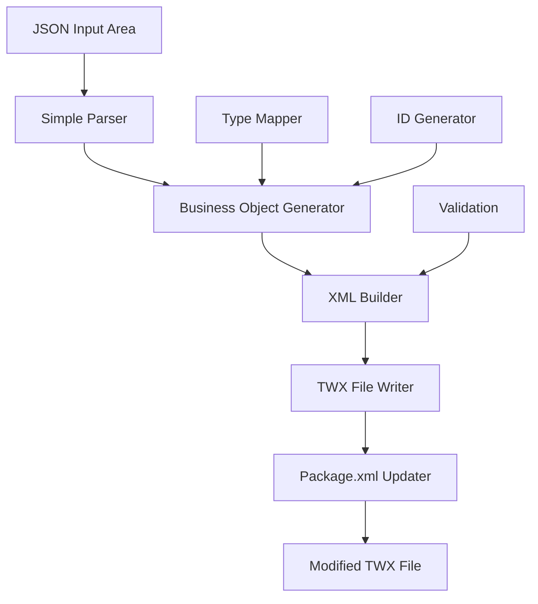
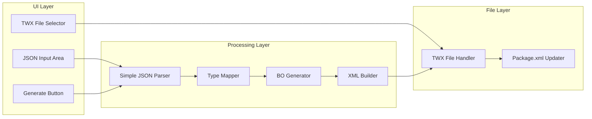

# Design Document

## Overview

The Business Object Builder is a streamlined tool that transforms simple JSON object definitions into IBM BPM Business Objects and writes them directly to TWX files. The system provides a simple input interface where developers can define objects using familiar syntax, and automatically generates the complex XML structure required by IBM BPM.

## Architecture

### High-Level Architecture



### Component Architecture



## Components and Interfaces

### 1. Simple JSON Parser

**Purpose:** Parse simple JSON object definitions and extract object name and properties.

**Interface:**
```javascript
class SimpleJSONParser {
  constructor()
  
  // Parse simple JSON object definition
  parseObjectDefinition(jsonText)
  
  // Extract object name and properties
  extractObjectStructure(definition)
  
  // Validate basic syntax
  validateSyntax(jsonText)
  
  // Parse property definitions
  parseProperties(propertiesText)
}
```

**Input Format Example:**
```javascript
// Simple object definition
customerObj {
  name: string,
  country: NameValuePair,
  age: Integer,
  isActive: Boolean
}
```

**Key Methods:**
- `parseObjectDefinition()`: Parse the simple JSON-like syntax
- `extractObjectStructure()`: Extract object name and properties
- `validateSyntax()`: Basic syntax validation
- `parseProperties()`: Parse individual property definitions

### 2. Business Object Generator

**Purpose:** Transform parsed object definition into IBM BPM Business Object structure.

**Interface:**
```javascript
class BusinessObjectGenerator {
  constructor()
  
  // Generate business object from parsed definition
  generateBusinessObject(objectDefinition)
  
  // Create properties from definition
  createProperties(properties)
  
  // Generate unique IDs
  generateObjectId()
  generateVersionId()
  
  // Apply IBM BPM naming conventions
  sanitizeName(name)
}
```

**Business Object Structure:**
```javascript
const businessObjectStructure = {
  id: 'string',           // Generated unique ID (12.xxx format)
  versionId: 'string',    // Generated version ID (UUID)
  name: 'string',         // Object name (sanitized)
  properties: [           // Array of properties
    {
      name: 'string',
      bpmType: 'string',    // IBM BPM type reference
      isRequired: 'boolean',
      description: 'string'
    }
  ],
  metadata: {
    createdAt: 'string',
    createdBy: 'BusinessObjectBuilder'
  }
}
```

### 3. XML Builder

**Purpose:** Convert business object definitions into IBM BPM XML format.

**Interface:**
```javascript
class XMLBuilder {
  constructor()
  
  // Build complete XML for business object
  buildBusinessObjectXML(businessObject)
  
  // Build JSON schema data for IBM BPM
  buildJSONData(businessObject)
  
  // Build definition structure
  buildDefinition(businessObject)
  
  // Build property definitions
  buildProperties(properties)
  
  // Format XML properly
  formatXML(xmlContent)
}
```

**XML Template Structure:**
```xml
<?xml version="1.0" encoding="UTF-8"?>
<teamworks>
    <twClass id="{objectId}" name="{objectName}">
        <lastModified>{timestamp}</lastModified>
        <lastModifiedBy>BusinessObjectBuilder</lastModifiedBy>
        <classId>{objectId}</classId>
        <type>1</type>
        <isSystem>false</isSystem>
        <shared>false</shared>
        <isShadow>false</isShadow>
        <globalLifetime>false</globalLifetime>
        <internalName isNull="true" />
        <extensionType isNull="true" />
        <saveServiceRef isNull="true" />
        <bpmn2Data isNull="true" />
        <externalId>itm.{objectId}</externalId>
        <dependencySummary isNull="true" />
        <jsonData>{jsonSchemaData}</jsonData>
        <description>{description}</description>
        <guid>{guid}</guid>
        <versionId>{versionId}</versionId>
        <definition>
            {propertyDefinitions}
        </definition>
    </twClass>
</teamworks>
```

### 4. TWX File Handler

**Purpose:** Directly modify TWX files without extraction/compression cycle.

**Interface:**
```javascript
class TWXFileHandler {
  constructor()
  
  // Open TWX file for modification
  openTWXFile(twxFilePath)
  
  // Add new business object to TWX
  addBusinessObjectToTWX(twxFile, businessObjectXML, objectId)
  
  // Update package.xml within TWX
  updatePackageXMLInTWX(twxFile, newObjectInfo)
  
  // Save modified TWX file
  saveTWXFile(twxFile, outputPath)
  
  // Generate object filename
  generateObjectFileName(objectId)
}
```

### 5. Type Mapper

**Purpose:** Map simple type names to IBM BPM type references.

**Interface:**
```javascript
class TypeMapper {
  constructor()
  
  // Map simple type to IBM BPM type
  mapType(simpleType)
  
  // Get IBM BPM type reference
  getBPMTypeReference(type)
  
  // Check if type is supported
  isSupportedType(type)
  
  // Get type suggestions for invalid types
  suggestType(invalidType)
}
```

**Type Mappings:**
```javascript
const typeMappings = {
  'string': '12.db884a3c-c533-44b7-bb2d-47bec8ad4022',      // String
  'Integer': '12.c09c9b6e-aabd-4897-bef2-ed61db106297',     // Integer  
  'Boolean': '12.83ff975e-8dbc-42e5-b738-fa8bc08274a2',     // Boolean
  'Date': '12.19e8dc33-1100-46be-89a6-36c9040f7b3e',        // Date
  'NameValuePair': 'toolkit.TWSYS.NameValuePair'            // System toolkit type
}
```

## Data Models

### Simple JSON Input Model
```javascript
// Input format example:
const simpleObjectInput = `
customerObj {
  name: string,
  country: NameValuePair,
  age: Integer,
  isActive: Boolean
}
`;

// Parsed structure:
const parsedInput = {
  objectName: 'customerObj',
  properties: [
    { name: 'name', type: 'string' },
    { name: 'country', type: 'NameValuePair' },
    { name: 'age', type: 'Integer' },
    { name: 'isActive', type: 'Boolean' }
  ]
}
```

### Business Object Definition Model
```javascript
const businessObjectDefinition = {
  id: 'string',                    // Format: 12.xxxxxxxx-xxxx-xxxx-xxxx-xxxxxxxxxxxx
  versionId: 'string',             // UUID format
  name: 'string',                  // Sanitized object name
  properties: [
    {
      name: 'string',              // Property name
      bpmTypeRef: 'string',        // IBM BPM type reference
      isRequired: 'boolean',       // Default: false
      isHidden: 'boolean',         // Default: false
      isArray: 'boolean'           // Default: false
    }
  ],
  metadata: {
    createdAt: 'string',           // ISO timestamp
    createdBy: 'BusinessObjectBuilder'
  }
}
```

### Generation Settings Model
```javascript
const generationSettings = {
  naming: {
    objectPrefix: 'string',
    objectSuffix: 'string',
    propertyCase: 'camelCase|PascalCase|snake_case',
    removeSpecialChars: 'boolean'
  },
  namespace: 'string',
  defaults: {
    propertyRequired: 'boolean',
    propertyHidden: 'boolean',
    stringMaxLength: 'number'
  },
  validation: {
    enforceNamingConventions: 'boolean',
    checkReservedWords: 'boolean',
    validateReferences: 'boolean'
  },
  output: {
    includeDescriptions: 'boolean',
    generateComments: 'boolean',
    formatXML: 'boolean'
  }
}
```

## Error Handling

### Error Categories

1. **Schema Validation Errors**
   - Invalid JSON schema format
   - Unsupported schema features
   - Circular reference detection

2. **Generation Errors**
   - Naming convention violations
   - Type mapping failures
   - Reference resolution errors

3. **File System Errors**
   - TWX file corruption
   - Permission issues
   - Disk space problems

4. **XML Generation Errors**
   - Invalid XML structure
   - Encoding issues
   - Template processing errors

### Error Recovery Strategies

- **Graceful Degradation**: Continue processing other objects when one fails
- **Rollback Capability**: Restore original TWX file if operation fails
- **Detailed Logging**: Comprehensive error reporting for debugging
- **User Guidance**: Clear error messages with suggested fixes

## Testing Strategy

### Unit Testing
- JSON schema parsing with various input formats
- Business object generation with different configurations
- XML building and validation
- TWX file manipulation operations

### Integration Testing
- End-to-end workflow from JSON to TWX
- Complex schema processing with references
- Multiple business object generation
- Package.xml update verification

### Performance Testing
- Large schema processing
- Multiple object generation
- TWX file compression/decompression
- Memory usage optimization

## Implementation Considerations

### Security
- Input validation and sanitization
- File system access controls
- Temporary file cleanup
- XML injection prevention

### Performance
- Streaming processing for large schemas
- Efficient XML generation
- Optimized file operations
- Memory management for large TWX files

### Extensibility
- Plugin architecture for custom type mappings
- Template system for XML generation
- Configurable validation rules
- Custom naming convention support

### User Experience
- Progressive disclosure of advanced features
- Real-time validation feedback
- Undo/redo capabilities
- Batch processing support

## Configuration Options

```javascript
const builderConfiguration = {
  parser: {
    resolveReferences: true,
    strictMode: false,
    maxDepth: 10
  },
  generator: {
    namingConvention: 'PascalCase',
    namespace: 'http://custom-namespace',
    includeMetadata: true
  },
  xml: {
    formatOutput: true,
    includeComments: true,
    encoding: 'UTF-8'
  },
  twx: {
    backupOriginal: true,
    validateIntegrity: true,
    compressionLevel: 6
  }
}
```

This design provides a comprehensive foundation for implementing the Business Object Builder with proper separation of concerns, extensibility, and robust error handling.