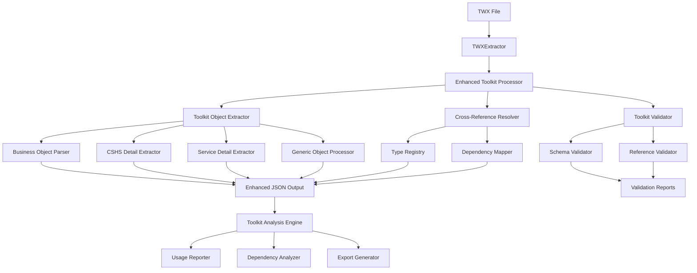

# Design Document

## Overview

The Enhanced Toolkit Parsing feature will extend the existing TWX parser to provide comprehensive extraction, analysis, and reporting capabilities for toolkit objects. The design builds upon the current toolkit extraction foundation while adding advanced detail extraction, cross-reference resolution, validation, and reporting capabilities.

## Architecture

### Current State Analysis

The existing system already has basic toolkit extraction capabilities:
- `TWXExtractor.extractToolkits()` extracts toolkit metadata and objects
- `JSONParser` generates separate toolkit object files
- `JSONWorkspace` provides basic toolkit access methods
- Web UI displays toolkit objects alongside application objects

### Enhanced Architecture Components



## Components and Interfaces

### 1. Enhanced Toolkit Processor

**Purpose:** Orchestrates the enhanced toolkit parsing workflow

**Interface:**
```javascript
class EnhancedToolkitProcessor {
  constructor(businessObjectParser, typeRegistry)
  
  async processToolkits(toolkits, applicationObjects)
  async extractDetailedObjects(toolkitZip, objectList, toolkitInfo)
  async resolveToolkitCrossReferences(allObjects)
  async validateToolkitIntegrity(toolkitObjects)
}
```

**Responsibilities:**
- Coordinate detailed object extraction for all toolkit objects
- Manage cross-reference resolution across toolkits and applications
- Trigger validation processes
- Integrate with existing TWXExtractor workflow

### 2. Toolkit Object Detail Extractors

**Enhanced Business Object Extractor:**
```javascript
class ToolkitBusinessObjectExtractor {
  extractToolkitBusinessObjectDetails(twClassElement, baseObject, toolkitInfo)
  resolveToolkitTypeReferences(schema, toolkitRegistry)
  validateBusinessObjectSchema(schema)
}
```

**Enhanced CSHS Extractor:**
```javascript
class ToolkitCSHSExtractor {
  extractToolkitCSHSDetails(processElement, baseObject, toolkitInfo)
  parseToolkitCoachflowElements(coachflow, details)
  extractToolkitVariableReferences(variables)
}
```

**Enhanced Service Extractor:**
```javascript
class ToolkitServiceExtractor {
  extractToolkitServiceDetails(processElement, baseObject, toolkitInfo)
  parseToolkitServiceScripts(items, toolkitInfo)
  validateServiceParameters(parameters)
}
```

### 3. Cross-Reference Resolution System

**Toolkit Type Registry:**
```javascript
class ToolkitTypeRegistry extends BusinessObjectTypeRegistry {
  registerToolkitType(typeName, typeId, schema, namespace, toolkitInfo)
  resolveToolkitTypeReference(typeName, sourceToolkit)
  getToolkitDependencies(toolkitId)
  detectCircularDependencies()
}
```

**Dependency Mapper:**
```javascript
class ToolkitDependencyMapper {
  mapApplicationToToolkitDependencies(appObjects, toolkitObjects)
  mapToolkitToToolkitDependencies(toolkits)
  generateDependencyGraph()
  identifyUnusedToolkitObjects(dependencies)
}
```

### 4. Validation System

**Toolkit Validator:**
```javascript
class ToolkitValidator {
  validateToolkitObjects(toolkitObjects)
  validateCrossReferences(allObjects, typeRegistry)
  validateBusinessObjectSchemas(businessObjects)
  generateValidationReport(validationResults)
}
```

**Validation Rules:**
- Schema consistency checks for business objects
- Reference integrity validation
- Parameter type validation for services
- Variable reference validation for CSHS objects

### 5. Analysis and Reporting System

**Toolkit Analysis Engine:**
```javascript
class ToolkitAnalysisEngine {
  analyzeToolkitUsage(toolkits, applications, dependencies)
  generateUsageStatistics(toolkitObjects, dependencies)
  identifyOrphanedObjects(toolkitObjects, dependencies)
  calculateComplexityMetrics(toolkitObjects)
}
```

**Enhanced Export System:**
```javascript
class ToolkitExportGenerator {
  exportToolkitAnalysis(analysisData, format)
  generateToolkitDocumentation(toolkits, analysisData)
  exportDependencyMappings(dependencies, format)
  createToolkitUsageReport(usageData)
}
```

## Data Models

### Enhanced Toolkit Object Model

```javascript
{
  // Existing fields
  id: string,
  versionId: string,
  name: string,
  type: string,
  typeName: string,
  source: "toolkit",
  toolkitInfo: {
    fileName: string,
    name: string,
    shortName: string,
    id: string,
    isSystem: boolean,
    version: string,
    dependencies: string[]
  },
  
  // Enhanced fields
  details: {
    // Type-specific details with enhanced extraction
    // Business Objects: complete schema with resolved references
    // CSHS: complete variable and element extraction
    // Services: complete parameter and script extraction
  },
  
  // New analysis fields
  analysisData: {
    usageCount: number,
    referencedBy: string[],
    dependencies: string[],
    complexityScore: number,
    validationStatus: "valid" | "warning" | "error",
    validationMessages: string[]
  }
}
```

### Toolkit Dependency Model

```javascript
{
  sourceObject: {
    id: string,
    name: string,
    type: string,
    source: "application" | "toolkit",
    toolkitInfo?: object
  },
  targetObject: {
    id: string,
    name: string,
    type: string,
    source: "application" | "toolkit",
    toolkitInfo?: object
  },
  dependencyType: "type_reference" | "service_call" | "variable_reference" | "inheritance",
  strength: "strong" | "weak",
  validationStatus: "valid" | "broken"
}
```

## Error Handling

### Validation Error Categories

1. **Schema Errors:** Invalid business object schemas, missing properties
2. **Reference Errors:** Broken cross-references, missing dependencies
3. **Type Errors:** Invalid type mappings, circular dependencies
4. **Structural Errors:** Malformed toolkit objects, missing required fields

### Error Recovery Strategies

- **Graceful Degradation:** Continue processing when non-critical errors occur
- **Partial Extraction:** Extract available details even when some components fail
- **Error Reporting:** Comprehensive error logs with actionable messages
- **Validation Warnings:** Non-blocking warnings for potential issues

## Testing Strategy

### Unit Testing

- **Object Extractors:** Test each extractor with various toolkit object types
- **Cross-Reference Resolution:** Test resolution with complex dependency scenarios
- **Validation Logic:** Test validation rules with valid and invalid objects
- **Analysis Engine:** Test usage analysis and reporting calculations

### Integration Testing

- **End-to-End Parsing:** Test complete toolkit parsing workflow
- **Multi-Toolkit Scenarios:** Test parsing TWX files with multiple toolkits
- **Cross-Toolkit Dependencies:** Test resolution across multiple toolkits
- **Export Generation:** Test all export formats and report generation

### Performance Testing

- **Large Toolkit Processing:** Test with toolkits containing hundreds of objects
- **Memory Usage:** Monitor memory consumption during cross-reference resolution
- **Processing Time:** Benchmark parsing time for various toolkit sizes
- **Concurrent Processing:** Test parallel processing of multiple toolkits

### Test Data Requirements

- Sample TWX files with various toolkit configurations
- Toolkits with complex business object schemas
- Toolkits with circular dependencies
- Toolkits with broken references for validation testing

## Implementation Considerations

### Backward Compatibility

- Maintain existing API interfaces
- Ensure existing functionality continues to work
- Provide migration path for existing data formats
- Support both enhanced and legacy output formats

### Performance Optimization

- Implement lazy loading for detailed object extraction
- Use caching for frequently accessed type registry data
- Optimize cross-reference resolution algorithms
- Implement parallel processing where possible

### Extensibility

- Plugin architecture for custom object type extractors
- Configurable validation rules
- Extensible export format system
- Modular analysis engine components

### Configuration Options

```javascript
{
  toolkit: {
    enableDetailedExtraction: true,
    enableCrossReferenceResolution: true,
    enableValidation: true,
    validationLevel: "strict" | "normal" | "lenient",
    exportFormats: ["json", "csv", "html"],
    analysisOptions: {
      calculateUsageStatistics: true,
      identifyOrphanedObjects: true,
      generateComplexityMetrics: true
    }
  }
}
```