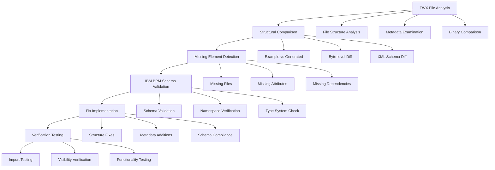

# IBM BPM Business Object Visibility Fix - Design

## Overview

This design document outlines a comprehensive investigation and fix strategy for the IBM BPM business object visibility issue. The approach involves deep forensic analysis of IBM BPM's internal structure requirements, systematic comparison with working examples, and implementation of missing components.

## Architecture

### Investigation Framework



### Deep Analysis Components

#### 1. Forensic TWX Analyzer
- **Purpose**: Perform byte-level analysis of TWX files
- **Functionality**: 
  - Compare working vs non-working TWX files
  - Identify structural differences
  - Analyze file ordering and compression
  - Examine ZIP metadata and headers

#### 2. IBM BPM Schema Validator
- **Purpose**: Validate against IBM BPM's exact schema requirements
- **Functionality**:
  - XML schema validation
  - Namespace verification
  - Attribute completeness checking
  - Type system validation

#### 3. Metadata Discovery Engine
- **Purpose**: Identify missing metadata and configuration
- **Functionality**:
  - Scan for missing files
  - Analyze project configuration
  - Check dependency declarations
  - Validate version information

#### 4. Business Object Inspector
- **Purpose**: Deep inspection of business object XML structure
- **Functionality**:
  - Element-by-element comparison
  - Attribute validation
  - JSON schema verification
  - Annotation completeness

## Components and Interfaces

### 1. TWX Forensic Analyzer

```javascript
class TWXForensicAnalyzer {
  // Compare TWX files at binary level
  async compareFiles(workingTWX, generatedTWX)
  
  // Analyze ZIP structure and metadata
  async analyzeZipStructure(twxPath)
  
  // Check file ordering and compression
  async validateFileStructure(twxPath)
  
  // Generate detailed comparison report
  async generateComparisonReport(differences)
}
```

### 2. IBM BPM Schema Validator

```javascript
class IBMBPMSchemaValidator {
  // Validate business object XML against IBM BPM schema
  async validateBusinessObjectXML(xmlContent)
  
  // Check package.xml compliance
  async validatePackageXML(packageContent)
  
  // Verify namespace declarations
  async validateNamespaces(xmlContent)
  
  // Check type system compliance
  async validateTypeReferences(businessObject)
}
```

### 3. Missing Element Detector

```javascript
class MissingElementDetector {
  // Identify missing files by comparing with working examples
  async detectMissingFiles(twxPath, examplePath)
  
  // Find missing XML attributes
  async detectMissingAttributes(generatedXML, exampleXML)
  
  // Check for missing dependencies
  async detectMissingDependencies(packageXML)
  
  // Identify missing metadata
  async detectMissingMetadata(twxPath)
}
```

### 4. IBM BPM Compatibility Engine

```javascript
class IBMBPMCompatibilityEngine {
  // Ensure version compatibility
  async ensureVersionCompatibility(twxContent, targetVersion)
  
  // Fix toolkit dependencies
  async fixToolkitDependencies(packageXML)
  
  // Correct object ID formats
  async correctObjectIDs(businessObjects)
  
  // Apply IBM BPM specific fixes
  async applyIBMBPMFixes(twxContent)
}
```

## Data Models

### Investigation Report Model

```javascript
{
  twxFile: {
    path: string,
    size: number,
    structure: {
      entries: Array<ZipEntry>,
      compression: string,
      metadata: Object
    }
  },
  comparison: {
    missingFiles: Array<string>,
    differentFiles: Array<FileDifference>,
    structuralIssues: Array<StructuralIssue>
  },
  validation: {
    schemaErrors: Array<SchemaError>,
    namespaceIssues: Array<NamespaceIssue>,
    typeSystemErrors: Array<TypeError>
  },
  fixes: {
    required: Array<RequiredFix>,
    recommended: Array<RecommendedFix>,
    applied: Array<AppliedFix>
  }
}
```

### Business Object Analysis Model

```javascript
{
  objectId: string,
  name: string,
  xmlStructure: {
    elements: Array<XMLElement>,
    attributes: Array<XMLAttribute>,
    namespaces: Array<Namespace>
  },
  validation: {
    schemaCompliant: boolean,
    missingElements: Array<string>,
    invalidAttributes: Array<string>
  },
  ibmBPMCompatibility: {
    compatible: boolean,
    issues: Array<CompatibilityIssue>,
    fixes: Array<CompatibilityFix>
  }
}
```

## Error Handling

### Investigation Errors
- **File Access Errors**: Handle locked or inaccessible TWX files
- **Parsing Errors**: Graceful handling of malformed XML or ZIP files
- **Comparison Errors**: Handle cases where example files are missing
- **Validation Errors**: Provide detailed error messages for schema violations

### Fix Application Errors
- **Backup Failures**: Ensure original files are preserved
- **Write Permissions**: Handle file system permission issues
- **Corruption Prevention**: Validate fixes before applying
- **Rollback Capability**: Ability to undo applied fixes

## Testing Strategy

### 1. Forensic Analysis Testing
- Test with known working IBM BPM TWX files
- Test with various TWX file structures
- Validate comparison accuracy
- Test with corrupted or malformed files

### 2. Schema Validation Testing
- Test against IBM BPM 8.6+ schemas
- Validate with various business object structures
- Test namespace handling
- Validate type system compliance

### 3. Fix Verification Testing
- Test fixes with actual IBM BPM Designer
- Validate object visibility after fixes
- Test object functionality in processes
- Verify compatibility across IBM BPM versions

### 4. Integration Testing
- End-to-end testing with complete workflow
- Test with various input scenarios
- Validate fix persistence
- Test rollback functionality

## Implementation Phases

### Phase 1: Deep Investigation Tools
1. Implement TWX Forensic Analyzer
2. Create IBM BPM Schema Validator
3. Build Missing Element Detector
4. Develop comparison and reporting tools

### Phase 2: Root Cause Analysis
1. Analyze working IBM BPM examples in detail
2. Compare with generated TWX files
3. Identify specific missing elements
4. Document IBM BPM's exact requirements

### Phase 3: Fix Implementation
1. Implement identified fixes
2. Add missing metadata and files
3. Correct XML structure issues
4. Ensure schema compliance

### Phase 4: Verification and Testing
1. Test fixes with IBM BPM Designer
2. Verify object visibility and functionality
3. Test across different IBM BPM versions
4. Document final solution

## Success Criteria

### Technical Success
- Business objects appear in IBM BPM Designer library
- All object properties are accessible and editable
- Objects function correctly in business processes
- Solution works across IBM BPM versions 8.6+

### Quality Success
- 100% schema compliance with IBM BPM requirements
- Comprehensive diagnostic and debugging tools
- Detailed documentation of IBM BPM requirements
- Automated testing and validation framework

This design provides a systematic approach to identifying and fixing the root cause of the IBM BPM business object visibility issue through comprehensive investigation and targeted fixes.