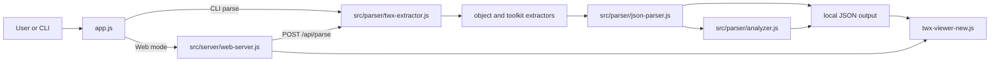

# TWX Awesome Parser

TWX Awesome Parser is a local tool for inspecting IBM Business Automation Workflow (BAW) process applications exported as `.twx` packages. It turns the archive into a searchable object inventory, resolves dependencies across the application and its toolkits, and performs focused static analysis of supported application scripts.

The project can run from Node.js or as a standalone Windows x64 executable. Parsing happens locally; no TWX content is uploaded to an external service.

## What it offers

- Parse `.twx` process applications and their embedded toolkits.
- Browse application objects by normalized type.
- Inspect object metadata, variables, elements, scripts, and raw details.
- Search names and XML content.
- Explore dependencies and where-used relationships.
- Use toolkit objects as context when resolving application references.
- Analyze selected application-owned CSHS, Service, and BPD scripts.
- Build a standalone Windows x64 executable.

The browser UI provides Summary, By Type, Toolkits, Search, Dependencies, Analyzer, and Settings views.

## How object types are identified

A `.twx` file is a ZIP archive with an IBM-defined structure:

```text
application.twx
├── META-INF/
│   ├── package.xml
│   └── metadata.xml
├── objects/
│   └── <versionId>.xml
├── toolkits/
│   └── <embedded-toolkit>.zip
└── files/
```

Identification happens in four stages:

1. `src/parser/twx-extractor.js` opens the archive and reads `META-INF/package.xml`.
2. Manifest entries provide object IDs, version IDs, raw types, names, and dependency references.
3. The corresponding `objects/<versionId>.xml` file supplies type-specific details such as variables, process elements, scripts, and schemas.
4. `src/utils/Constants.js`, `src/utils/type-mappings.js`, and the business-object/toolkit registries translate IBM type codes into stable UI groups.

Process objects receive one extra classification step. A process whose `subType` or parsed `processType` is `10` is grouped as CSHS; other process objects are grouped as Service. BPD and other object types use their normalized manifest type.

Application and toolkit objects are tagged with their source. The parser then builds `allObjects`, a combined view used for cross-reference resolution without losing ownership information.

## How the analyzer works

The analyzer is implemented in `src/parser/analyzer.js`. It receives application objects plus toolkit context from `src/parser/json-parser.js`.

Its scope is intentionally narrow:

- It reports findings only for application-owned CSHS, Service, and BPD elements.
- Toolkit code is not analyzed.
- Toolkit object and service names are used to resolve references made by the application.
- Client-side assets, HTML, and non-JavaScript/template content are excluded from JavaScript analysis.
- IBM BAW template syntax such as `<#=tw.env.NAME#>` remains valid content and is not treated as a JavaScript syntax error.
- Process variables declared on the owning element are accepted as declared.
- IBM BAW and JavaScript runtime globals are accepted, including `tw`, `alert`, `require`, `window`, and `page`.

Each supported script is parsed into an abstract syntax tree with Acorn. Scope analysis finds unresolved identifiers, while targeted AST checks look for demonstrable correctness and maintainability problems. Findings include the application object, element, script role, line, column, code snippet, evidence, and remediation.

### Finding groups

| Group | Examples |
| --- | --- |
| Confirmed critical | JavaScript syntax error, undefined identifier, definite division by zero, definite null/undefined access, unsafe dynamic execution |
| Confirmed warnings | Undeclared process variable, loop with no demonstrable exit, active `debugger`, `parseInt` without an explicit radix |
| Needs review | Empty catch block, dynamic SQL construction, possible embedded secret, possible hardcoded business constant |

The Analyzer UI presents all three groups with the same collapsed hierarchy:

```text
finding status
└── finding type
    └── application element
        └── finding details and location
```

The analyzer recognizes BAW versions 19, 20, 21, 23, and 24 from metadata or an override. If no supported version can be identified, general checks still run and the report records that version-specific checks were skipped.

> Static analysis is advisory. Confirm a finding in the IBM BAW runtime and application context before changing production logic.

## Toolkit behavior

Toolkits improve the quality of application analysis; they are not analyzer targets.

For example, when an application references an object or service declared inside an included toolkit, that declaration is added to analyzer context. The reference can therefore be recognized as valid instead of being reported as undefined. Findings remain limited to code owned by the process application.

## Architecture and calling order



In web mode, `app.js` starts the local HTTP server on an available localhost port and opens the viewer. The parse API invokes the same extractor and JSON generator used by CLI mode. The browser reads generated JSON and API responses; it does not parse TWX archives directly.

For a detailed module map and end-to-end walkthrough, see [docs/ARCHITECTURE.md](docs/ARCHITECTURE.md).

## Requirements

- Node.js 20.19 or newer when running or building from source.
- npm.
- Windows x64 for the packaged executable produced by the included build configuration.

## Quick start from source

```powershell
git clone https://github.com/MohamedReda97/twx-awesome-parser.git
cd twx-awesome-parser
npm ci
```

On Windows:

```powershell
.\start-server.bat
```

Or on any supported Node.js environment:

```powershell
npm start
```

The app starts on an available `localhost` port and opens the browser. Choose a `.twx` package in the UI to parse it.

## CLI usage

Parse a TWX package without starting the web UI:

```powershell
node app.js parse "C:\path\to\application.twx"
```

An already extracted TWX directory is also accepted:

```powershell
node app.js parse "C:\path\to\extracted-application"
```

Show the available commands:

```powershell
node app.js --help
```

CLI mode writes generated data to `output/` and then exits.

## Library API

`src/index.js` exports the current programmatic API:

```js
const { createWorkspace, parseTWX, extractTWX } = require('./src')

const parsed = await parseTWX('application.twx', './output')
console.log(parsed.summary)

const extracted = await extractTWX('application.twx')
console.log(extracted.metadata, extracted.allObjects.length)

const workspace = createWorkspace('./output')
```

## Standalone Windows build

Run:

```powershell
.\build.bat
```

The builder installs locked dependencies, runs tests, packages the application, and smoke-tests the result. The output is:

```text
dist/twx-parser.exe
```

The build machine requires Node.js and npm. The resulting executable contains its Node.js runtime and does not require Node.js on the target Windows x64 PC. Other operating systems and CPU architectures are not produced by the current build configuration.

The executable is intentionally excluded from Git. Publish it as a GitHub Release asset rather than committing it to the repository.

## Generated files

Depending on the package contents, parsing generates:

| File | Purpose |
| --- | --- |
| `twx-summary.json` | Package metadata, counts, and type summary |
| `objects-<type>.json` | Application objects grouped by type |
| `toolkit-objects-<type>.json` | Toolkit objects grouped by type |
| `combined-objects-<type>.json` | Application and toolkit objects combined for browsing/resolution |
| `toolkits.json` | Included toolkit metadata |
| `metadata.json` | Parsed package metadata |
| `dependencies.json` | Dependency relationships |
| `analysis.json` | Analyzer coverage, diagnostics, summaries, and findings |

These files may contain proprietary process details. They are local runtime output and are ignored by Git.

## Project structure

```text
app.js                         CLI and web-mode entry point
src/index.js                   library API
src/parser/                    TWX extraction, object parsing, JSON output, analyzer
src/parser/toolkit/            toolkit extraction and context helpers
src/server/web-server.js       local HTTP server and API routes
src/search/                    XML and API search
src/classes/                   workspace and domain models
src/utils/                     IBM constants, type registries, filenames, helpers
twx-viewer-new.html            browser shell
twx-viewer-new.css             browser styling
twx-viewer-new.js              browser behavior and API consumption
test-analyzer-v2.js            analyzer behavior checks
test-analyzer-ui.js            analyzer rendering checks
test-architecture-presentation.js  presentation integrity check
build.bat                      verified Windows x64 builder
```

## Testing

Run all supported checks:

```powershell
npm test
npm run lint
```

The lint command covers the actively maintained analyzer and test files. Legacy parser modules retain their historical formatting and are exercised through runtime tests.

Verify the complete Windows packaging flow:

```powershell
.\build.bat --no-pause
```

## Scope and limitations

- The analyzer is static and intentionally conservative; it does not execute scripts or reproduce the full BAW runtime.
- Analysis is limited to supported application-owned CSHS, Service, and BPD script locations.
- Toolkit declarations improve reference resolution, but toolkit scripts are not analyzed.
- Dynamic runtime behavior, indirect references, external systems, database contents, and deployment configuration may require manual review.
- Version-specific checks require recognizable BAW version metadata or an explicit override.

## Privacy

TWX packages can contain source code, object names, schemas, integration details, and business logic. Keep real packages, extracted directories, generated JSON, logs, screenshots, and packaged executables outside Git. The supplied `.gitignore` excludes these local artifacts.

## Documentation

- [Architecture guide](docs/ARCHITECTURE.md)
- [Self-contained technical presentation](docs/TWX-Architecture-Presentation.html)

## License

Licensed under the [MIT License](LICENSE). Original copyright and attribution are preserved.
